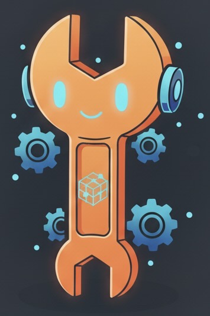

#  TinkerDB

A distributed key-value database in Go, built as an educational project to learn distributed systems concepts through hands-on implementation.

## Project Overview

TinkerDB is a personal learning project that aims to build a fully functional distributed database from scratch. Starting with a simple key-value store, the project will evolve through six major milestones to become a production-ready distributed system with features like:

- **Distributed Consensus** (Raft algorithm)
- **Data Persistence** (Write-ahead logging)
- **Horizontal Scaling** (Sharding and partitioning)
- **Fault Tolerance** (Automatic failover and recovery)
- **Production Features** (Monitoring, security, performance optimization)

## Current Status

### Milestone - 1 in progress

This project is currently in **active development** and is **open source**. Since it is still under development, I am not accepting contributions at this time. It's a personal educational endeavor to deepen understanding of distributed systems, consensus algorithms, and eventually venture into database internals.

## Getting Started

- For detailed project requirements, milestones, and technical specifications, see [REQUIREMENTS.md](./REQUIREMENTS.md).
- To set up the project or troubleshoot errors, see [SETUP.md](./SETUP.md)
- If you already have the project set up, use [QUICKSTART.md](./QUICKSTART.md) to jump right in.

## Tech Stack (last updated 10/2/2025)

- **Languages**: Go

## License

This project is licensed under the MIT License - see the [LICENSE](LICENSE) file for details. However, while the code is available under an open source license, this is currently a **personal educational project** and is **not accepting contributions** at this time.

## Meet Tink - the unofficial mascot for TinkerDB until a better image generation model comes out :)

  

